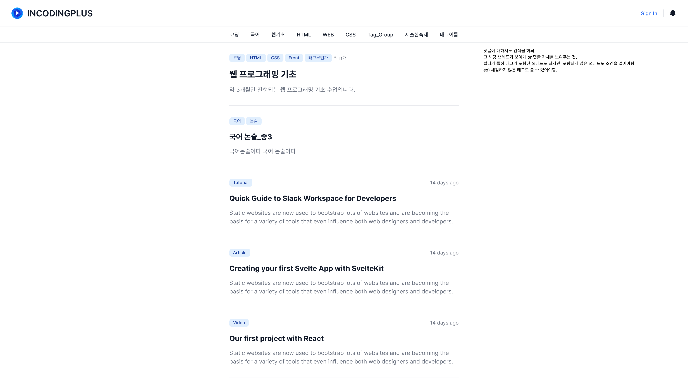
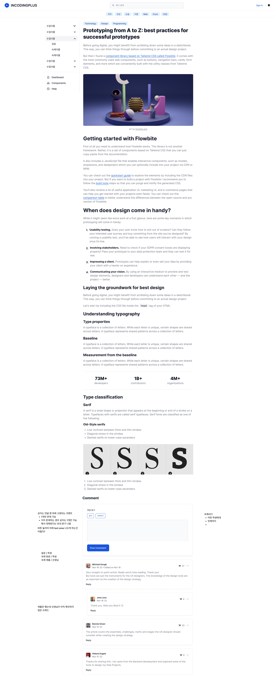

# 메인 페이지 요구사항

## 기능 요구사항

- Header
  - Sign In 버튼을 누르면 구글 로그인 기능이 나옴
  - 다른 서브 페이지에서도 보여야함.
- Neck
  - 필터들은 사용자에 따라 서로 다른 필터 목록들을 DB로부터 받아옴
  - 필터 하나에는 다양한 태그들의 포함 및 미포함이 그룹화 되어진 기능
  - 필터를 누를 시 서버로 부터 조건에 맞는 **쓰레드**와 **메세지** 목록을 받아옴
  - **쓰레드**와 **메세지** 목록은 다음과 같은 정보를 꼭 포함하고 있어야 함.
    - 쓰레드 : `title` ,`tags`, `description`, `threadId`
    - 댓글 : `title`, `tags`, `body`, `messageId`, `threadId`
- Body
  - 태그의 목록은 보이는정해진 쓰레드 보이는 너비 안쪽까지만 나열되며, 그 이상 나열될 것 같으면 **외 n개** 와 같이 표현
  - 오른쪽 위에는 쓰레드 또는 댓글이 수정된 날짜가 뜸
  - `title`은 줄바꿈으로 길이를 처리함.
  - 쓰레드의 `description`과 댓글의 `body`가 똑같이 작은 회색 글씨로 보임
  - 쓰레드 목록을 클릭시 (클릭 범위는 태그에서부터 description까지) `/threads/$threadId`로 넘어감
  - 댓글 목록을 클릭시 `/thread/$threadId#$messageId`로 넘어감
  - Body는 무한 스크롤로 보이며, 목록 한번에 **15**개가 보임

# 쓰레드 페이지 요구사항

- Side
  - 해당 쓰레드의 Navigation이 보임
  - 쓰레드의 Navigation은 일정한 순서로 되어 있어야함.
  - Navigation을 누를 경우 해당 쓰레드로 가며, 만약 자식 쓰레드가 있는 경우에는 Dropdown이 열림
- Body
  - 맨위에는 태그와 타이틀이 보임.
  - 태그는 일정 이상 넘어가면 `...` 이렇게 보이며, 클릭시 펼쳐짐 (한줄이 기준)
  - 타이틀은 줄바꿈으로 처리
- 댓글
  - 댓글에서는 일정 태그 또는 속성을 선택할 수 있는 매크로 버튼이 있어야함. (예 : 숙제 내기 클릭 시 : 숙제 태그, 숙제 안함, 기한 태그 등이 붙음)
  - 각 댓글에는 서브 기능들이 존재하며, 위쪽 상단에 있음.
    - 숙제 채점 (숙제인 경우에만)
    - 다시 숙제 내기 (숙제인 경우에만)
    - 수정 (본인 혹은 선생님)
    - 삭제 (본인 혹은 선생님)
  - 각 댓글에는 답글 기능이 존재
  - 각 댓글에는 파일 첨부 기능이 존재 (폴더를 올릴 시 자동 압축 기능이 있으면 좋을 듯)
  - 각 댓글에는 고유 Id가 있어서 해시로 스크롤 자동 이동이 가능
  - 댓글의 양식은 **markdown**
  - 댓글 목록은 무한 스크롤이 가능함.

# API 요구 사항

- `/api/threads/create` : POST 요청시 쓰레드를 등록할 수 있도록 함. (권한 제어 필요)
  - 여러개의 쓰레드를 등록하는 API가 필요
  - 등록하는 내용은 **Markdown**과 **PDF** 두 가지가 있어야함.
- `/api/threads/update` : POST 요청시 쓰레드를 수정할 수 있도록 함. (권한 제어 필요)
  - 한 번에 하나의 쓰레드를 수정할 수 있으면 됨.
- `/api/threads/delete` : POST 요청시 쓰레드를 삭제할 수 있도록 함. (권한 제어 필요)
  - 여러개의 쓰레드를 삭제할 수 있으면 좋을 듯
- `/api/threads/$threadId` : 접속 시 `threadId`의 쓰레드 정보를 가져오도록 함. (권한 제어 필요)
- `/api/threads/tags` : POST 요청시 포함 태그와, 포함하지 않는 태그의 쓰레드 및 메시지 목록을 가져옴.
  - `limit`와 `skip` 키워드가 필수
- `/api/threads/message/create` : POST 요청시 특정 쓰레드에 댓글 등록
- `/api/threads/message/update` : POST 요청시 특정 쓰레드에 댓글 수정 및 상태 변경
- `/api/threads/message/delete` : POST 요청시 특정 쓰레드의 댓글 삭제 
- `/api/threads/message/read` : POST 요청시 특정 쓰레드의 댓글 목록을 가져옴
  - `limit`와 `skip` 키워드가 필수

## 비기능 요구사항

- 필터로 결과가 나오는 속도는 1초 안쪽
- 메인페이지부터 다른 모든 서브 페이지는 SPA
- 쓰레드의 구조는 부모 자식 관계
- 쓰레드의 태그 검색 속도는 최대한 빠른 것이 좋음